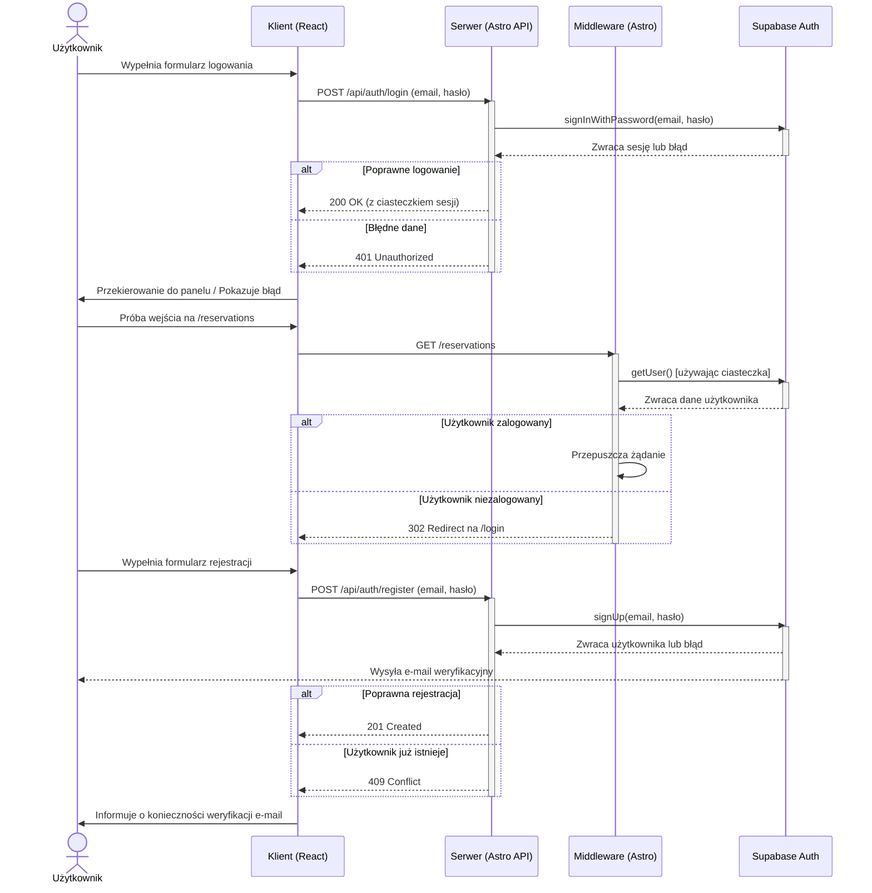

<authentication_flow_analysis>
### 1. Lista Procesów

Na podstawie specyfikacji technicznej, główne procesy autentykacji to:

*   **Weryfikacja Sesji (Middleware):** Proces uruchamiany przy każdym żądaniu HTTP w celu sprawdzenia, czy użytkownik posiada aktywną sesję.
*   **Logowanie (Login Flow):** Proces inicjowany przez użytkownika w celu uzyskania dostępu do chronionych zasobów aplikacji.
*   **Rejestracja (Registration Flow):** Proces tworzenia nowego konta przez użytkownika.
*   **Wylogowanie (Logout Flow):** Proces kończenia sesji przez zalogowanego użytkownika.
*   **Odzyskiwanie Hasła (Password Recovery Flow):** Wielostopniowy proces pozwalający użytkownikowi na zresetowanie zapomnianego hasła.

### 2. Główne Komponenty i Interakcje

*   **Klient (Przeglądarka):** Renderuje komponenty UI (formularze React) i wysyła żądania do API.
*   **Astro Middleware:** Pełni rolę strażnika (gatekeeper). Przechwytuje wszystkie żądania, komunikuje się z Supabase w celu weryfikacji sesji na podstawie ciasteczek i decyduje o dostępie do stron.
*   **Astro API Endpoints:** Warstwa backendowa aplikacji. Odbiera żądania od klienta, waliduje dane (za pomocą Zod) i wykonuje odpowiednie operacje na Supabase Auth.
*   **Supabase Auth:** Zewnętrzna usługa odpowiedzialna za całą logikę uwierzytelniania: zarządzanie użytkownikami, sesjami, wysyłanie e-maili transakcyjnych (weryfikacja, reset hasła) i obsługę bezpieczeństwa.

### 3. Opis Przepływów

*   **Weryfikacja Sesji:**
    1.  Przeglądarka wysyła żądanie do serwera (np. o stronę `/reservations`).
    2.  Middleware przechwytuje żądanie.
    3.  Middleware używa ciasteczka z żądania do zapytania Supabase o dane użytkownika.
    4.  **Jeśli użytkownik jest uwierzytelniony:** Supabase zwraca dane użytkownika, middleware zapisuje je w `Astro.locals` i przepuszcza żądanie dalej.
    5.  **Jeśli użytkownik nie jest uwierzytelniony:** Supabase zwraca `null`. Jeśli trasa jest chroniona, middleware zwraca przekierowanie (302) do `/login`.
*   **Logowanie:**
    1.  Użytkownik wypełnia `LoginForm` i wysyła żądanie do `POST /api/auth/login`.
    2.  Endpoint API waliduje dane.
    3.  Endpoint wywołuje `supabase.auth.signInWithPassword()`.
    4.  Supabase weryfikuje dane. Jeśli są poprawne, generuje token sesji i ustawia go w ciasteczku w odpowiedzi HTTP.
    5.  Klient otrzymuje odpowiedź 200 OK i przekierowuje użytkownika do panelu.
*   **Rejestracja:**
    1.  Użytkownik wypełnia `RegisterForm` i wysyła żądanie do `POST /api/auth/register`.
    2.  Endpoint API waliduje dane.
    3.  Endpoint wywołuje `supabase.auth.signUp()`.
    4.  Supabase tworzy nowego użytkownika (w stanie niezweryfikowanym) i wysyła e-mail z linkiem weryfikacyjnym.
    5.  Klient informuje użytkownika o konieczności sprawdzenia skrzynki mailowej.

### 4. Punkty Krytyczne i Zależności

*   **Ciasteczka (Cookies):** Są kluczowym elementem przepływu sesji. Muszą być poprawnie przekazywane między klientem, middleware i Supabase.
*   **Zmienne Środowiskowe:** Klucze API Supabase (`SUPABASE_URL`, `SUPABASE_ANON_KEY`) muszą być bezpiecznie przechowywane i dostępne dla aplikacji po stronie serwera.
*   **Konfiguracja RLS (Row-Level Security):** Chociaż nie jest to bezpośrednio część przepływu autentykacji, poprawne skonfigurowanie polityk RLS w Supabase jest kluczowe dla autoryzacji (kontroli dostępu do danych) po pomyślnym uwierzytelnieniu.
*   **Walidacja Danych (Zod):** Zapewnia, że do Supabase trafiają tylko dane o poprawnej strukturze, co chroni przed błędami i potencjalnymi atakami.

</authentication_flow_analysis>

<mermaid_diagram>

</mermaid_diagram>
