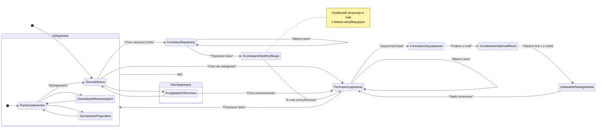

<user_journey_analysis>
### 1. Ścieżki Użytkownika

Na podstawie dokumentacji, zidentyfikowałem następujące kluczowe ścieżki (podróże) użytkownika:

*   **Przeglądanie jako gość:** Użytkownik (niezalogowany) może przeglądać publicznie dostępne części aplikacji, takie jak strona główna i dostępne terminy rezerwacji.
*   **Rejestracja:** Nowy użytkownik tworzy konto, podając e-mail i hasło, a następnie musi potwierdzić swój adres e-mail, klikając w link weryfikacyjny.
*   **Logowanie:** Istniejący użytkownik loguje się do systemu przy użyciu swojego e-maila i hasła.
*   **Odzyskiwanie hasła:** Użytkownik, który zapomniał hasła, może zainicjować proces jego resetowania. Otrzymuje e-mail z linkiem do strony, na której może ustawić nowe hasło.
*   **Korzystanie z aplikacji jako zalogowany użytkownik:** Po zalogowaniu użytkownik ma dostęp do chronionych sekcji, takich jak "Moje rezerwacje" i "Moje pojazdy", gdzie może zarządzać swoimi danymi.
*   **Wylogowanie:** Zalogowany użytkownik może w każdej chwili zakończyć swoją sesję.

### 2. Główne Podróże i Stany

*   **Podróż Gościa:**
    *   Stan początkowy: Wejście na stronę główną.
    *   Możliwe akcje: Przeglądanie terminów, przejście do logowania, przejście do rejestracji.
    *   Stan końcowy: Opuszczenie strony lub rozpoczęcie procesu autentykacji.
*   **Podróż Rejestracji:**
    *   Stan początkowy: Wejście na stronę rejestracji.
    *   Stany pośrednie: Wypełnienie formularza, walidacja danych, oczekiwanie na weryfikację e-mail.
    *   Stan końcowy: Konto utworzone i zweryfikowane, użytkownik może się zalogować.
*   **Podróż Logowania:**
    *   Stan początkowy: Wejście na stronę logowania.
    *   Stany pośrednie: Wypełnienie formularza, walidacja danych.
    *   Stan końcowy: Użytkownik zalogowany, dostęp do panelu.
*   **Podróż Odzyskiwania Hasła:**
    *   Stan początkowy: Kliknięcie "Zapomniałem hasła".
    *   Stany pośrednie: Podanie adresu e-mail, otrzymanie linku, ustawienie nowego hasła.
    *   Stan końcowy: Hasło zmienione, użytkownik może się zalogować.

### 3. Punkty Decyzyjne i Alternatywne Ścieżki

*   **Na stronie logowania:** Użytkownik może podać poprawne dane (ścieżka sukcesu), błędne dane (alternatywna ścieżka: ponowna próba) lub zdecydować się na odzyskanie hasła.
*   **Na stronie rejestracji:** Użytkownik może podać unikalny e-mail (sukces) lub e-mail, który już istnieje w bazie (alternatywna ścieżka: informacja o błędzie, możliwość przejścia do logowania).
*   **Po weryfikacji e-mail:** Link może być poprawny (sukces, konto aktywowane) lub niepoprawny/wygasły (błąd, opcja ponownego wysłania linku).
*   **Dostęp do chronionych zasobów:** Jeśli użytkownik jest zalogowany, widzi stronę. Jeśli nie jest, zostaje przekierowany do strony logowania.

### 4. Cel Każdego Stanu

*   **Strona Główna:** Pierwszy kontakt z aplikacją, punkt wyjścia do innych części serwisu.
*   **Formularz Rejestracji:** Zebranie danych niezbędnych do utworzenia nowego konta.
*   **Oczekiwanie na Weryfikację:** Stan pośredni, informujący użytkownika o konieczności potwierdzenia adresu e-mail w celu aktywacji konta.
*   **Formularz Logowania:** Uwierzytelnienie użytkownika i umożliwienie mu dostępu do spersonalizowanych treści.
*   **Panel Użytkownika:** Główny obszar, w którym zalogowany użytkownik zarządza swoimi rezerwacjami i pojazdami.
*   **Formularz Odzyskiwania Hasła:** Umożliwienie użytkownikowi odzyskania dostępu do konta w przypadku zapomnienia hasła.

</user_journey_analysis>

<mermaid_diagram>

</mermaid_diagram>
