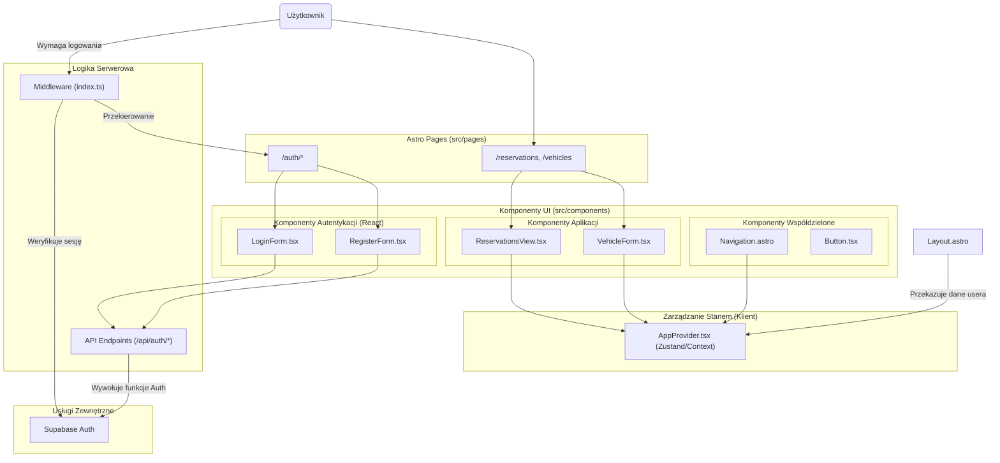

<architecture_analysis>
### 1. Lista Komponentów i Stron

Na podstawie analizy specyfikacji, system autentykacji będzie składał się z następujących elementów:

**Strony Astro (`src/pages/auth/`):**
*   `login.astro`: Strona logowania.
*   `register.astro`: Strona rejestracji.
*   `forgot-password.astro`: Strona do wysyłania prośby o reset hasła.
*   `reset-password.astro`: Strona do ustawiania nowego hasła.

**Endpointy API (`src/pages/api/auth/`):**
*   `login.ts`: Obsługuje logowanie użytkownika.
*   `register.ts`: Obsługuje rejestrację nowego użytkownika.
*   `logout.ts`: Obsługuje wylogowywanie.
*   `forgot-password.ts`: Inicjuje proces resetowania hasła.
*   `callback.ts`: Endpoint dla Supabase (np. po weryfikacji emaila).

**Komponenty React (`src/components/auth/`):**
*   `LoginForm.tsx`: Formularz do wprowadzania danych logowania.
*   `RegisterForm.tsx`: Formularz do rejestracji nowego konta.
*   `ForgotPasswordForm.tsx`: Formularz do wysłania prośby o reset hasła.
*   `ResetPasswordForm.tsx`: Formularz do ustawienia nowego hasła.

**Komponenty i Logika Współdzielona:**
*   `src/middleware/index.ts`: Middleware przechwytujący każde żądanie, weryfikujący sesję użytkownika i chroniący trasy.
*   `src/layouts/Layout.astro`: Główny layout aplikacji, przekazujący stan uwierzytelnienia z serwera do klienta.
*   `src/components/shared/AppProvider.tsx`: Komponent "Provider" (React Context lub Zustand), który przechowuje i udostępnia stan zalogowania po stronie klienta.
*   `src/components/shared/Navigation.astro`: Komponent nawigacji, który będzie dynamicznie renderował linki "Zaloguj/Zarejestruj" lub "Wyloguj" w zależności od stanu autentykacji.

### 2. Główne Strony i Ich Komponenty

*   Strona `login.astro` będzie renderować komponent `LoginForm.tsx`.
*   Strona `register.astro` będzie renderować `RegisterForm.tsx`.
*   Strona `forgot-password.astro` będzie renderować `ForgotPasswordForm.tsx`.
*   Strona `reset-password.astro` będzie renderować `ResetPasswordForm.tsx`.
*   Layout `Layout.astro` będzie opakowywał wszystkie strony i zawierał `AppProvider.tsx` do zarządzania stanem.

### 3. Przepływ Danych

1.  **Żądanie do serwera:** Użytkownik wchodzi na dowolną stronę.
2.  **Middleware:** `middleware/index.ts` sprawdza ciastko sesji Supabase.
    *   **Sesja istnieje:** Pobiera dane użytkownika i zapisuje je w `Astro.locals.user`.
    *   **Sesji brak:** `Astro.locals.user` jest `null`. Jeśli trasa jest chroniona, następuje przekierowanie do `/auth/login`.
3.  **Renderowanie strony:** `Layout.astro` odczytuje `Astro.locals.user` i przekazuje te dane jako `prop` do `AppProvider.tsx`.
4.  **Inicjalizacja stanu klienta:** `AppProvider.tsx` inicjalizuje stan (np. w React Context), udostępniając go wszystkim komponentom React na stronie.
5.  **Interakcja użytkownika (np. logowanie):**
    *   Użytkownik wypełnia `LoginForm.tsx` i klika "Zaloguj".
    *   Komponent wysyła żądanie `POST` do `/api/auth/login` z danymi.
    *   Endpoint API woła `supabase.auth.signInWithPassword()`.
    *   Po sukcesie, Supabase ustawia w odpowiedzi ciastko sesji.
    *   Aplikacja kliencka odświeża stronę lub przechodzi do panelu, a nowy stan jest odczytywany przez middleware.

### 4. Opis Funkcjonalności Komponentów

*   **`middleware/index.ts`**: Centralny punkt kontroli dostępu. Odpowiada za weryfikację sesji i ochronę stron wymagających zalogowania.
*   **Formularze React (`LoginForm`, `RegisterForm` itd.)**: Odpowiadają za interfejs użytkownika, walidację danych po stronie klienta i komunikację z backendowym API.
*   **Endpointy API (`/api/auth/*`)**: Czysta logika backendowa. Komunikują się z Supabase Auth w celu uwierzytelnienia użytkownika i zarządzania sesją.
*   **`Layout.astro` i `AppProvider.tsx`**: Mechanizm "mostu" (bridge) między serwerem a klientem. Zapewniają, że stan uwierzytelnienia jest spójny i dostępny zarówno podczas renderowania po stronie serwera, jak i w dynamicznych komponentach klienckich, co zapobiega "mruganiu" interfejsu (FOUC).
*   **`Navigation.astro`**: Dostosowuje widoczne dla użytkownika akcje w zależności od tego, czy jest zalogowany, czy nie.

</architecture_analysis>

<mermaid_diagram>

</mermaid_diagram>
